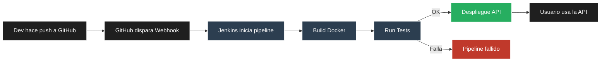

# Proyecto: API REST de Gestión de Tareas (TODO List) con CI/CD Automatizado

Este proyecto demuestra la implementación de una API RESTful simple para gestionar tareas (TODO List) utilizando FastAPI en Python, combinada con un pipeline de Integración Continua (CI) y Despliegue Continuo (CD) completamente automatizado con Docker y Jenkins.

---

## Pipeline de CI/CD (Jenkins)

El pipeline de CI/CD está definido como código en el `Jenkinsfile` ubicado en la raíz de este repositorio. Se compone de las siguientes etapas:

1.  **`Checkout Code`**: Clona el código fuente más reciente del repositorio de GitHub.
2.  **`Build Docker Image`**: Construye la imagen Docker de la aplicación FastAPI utilizando el `Dockerfile` del proyecto.
3.  **`Run Unit Tests`**: Ejecuta todas las pruebas unitarias de Pytest dentro de un contenedor Docker temporal, asegurando que el código cumple con la calidad esperada.
4.  **`Deploy Application`**: Detiene y elimina el contenedor Docker de la aplicación en ejecución (si existe) y despliega una nueva instancia con la imagen recién construida y probada.

### Flujo del Pipeline

A continuación se muestra un diagrama que ilustra el flujo completo del pipeline de CI/CD:

## Funcionalidades de la API

La API de tareas permite las siguientes operaciones:

    GET /: Mensaje de bienvenida de la API.

    GET /tasks: Obtener una lista de todas las tareas.

    POST /tasks: Crear una nueva tarea.

    GET /tasks/{task_id}: Obtener una tarea específica por su ID.

    PUT /tasks/{task_id}: Actualizar una tarea existente.

    DELETE /tasks/{task_id}: Eliminar una tarea por su ID.

    Nota: Las tareas se almacenan en memoria (app.task_db), lo que significa que se perderán al reiniciar el contenedor. Para un proyecto en producción, se integraría una base de datos persistente.

